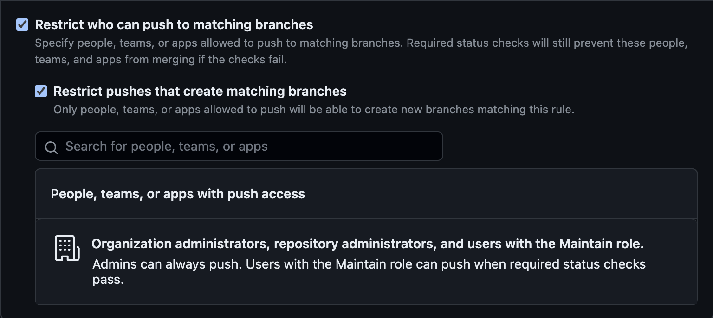

# RFD 1 - Mintlify migration workflow

We are moving the docs over to the hosted platform
[Mintlify](https://mintlify.com/), and want to update both our Mintlify-managed
site and our [current docs site](https://goteleport.com/docs/) with every
documentation PR we merge to gravitational/teleport. This document outlines a
high-level plan for managing the dual deployment.

## How Mintlify works

Mintlify is a SaaS platform that hosts customer documentation sites.

Mintlify detects pushes to a GitHub repo configured by a user and
updates the user's docs site based on Markdown source files within the
repo (either at the root of the repository or at a user-specified
directory).

Users can configure Mintlify to detect changes to a branch within a
repository. The "Set up as monorepo" option limits reads to a specific
directory:

## How the migration script works

The migration script is in the gravitational/docs repo (see [the
PR](https://github.com/gravitational/docs/pull/437)). This repo includes a
[submodule](https://github.com/gravitational/docs/tree/main/content) for each
supported version of gravitational/teleport, which are currently master,
branch/v15, branch/v14, and branch/v13. The migration script builds
Mintlify-compatible source files based on these submodules and places the output
in a directory in the gravitational/docs repo.

## Automating the migration script on "gravitational/teleport" merges

This strategy uses a GitHub Actions workflow in `gravitational/teleport` that
calls a child workflow in `gravitational/docs` when a docs PR is merged. The
child workflow runs the migration script and pushes to a protected branch in
`gravitational/docs`. We would then configure Mintlify to watch the migration
output directory in this protected branch.

This allows a single place to track deploys, and parallels the current
Vercel strategy.

### GitHub Actions workflow in `gravitational/docs`

This strategy uses an action in the `docs` repo with two triggers:

-   `workflow_call` (to receive incoming deploys from `teleport`)

-   push to main, which already has branch protections, to trigger a rebuild on
    changes to the migration script.

-   Has a dedicated GitHub application that is the only user allowed to write to
    a certain branch (say, `mintlify`) of `gravitational/docs`.

The workflow runs the migration script and, using
`actions/create-github-app-token`, assumes the identity of the dedicated GitHub
application. This application will push to a dedicated branch in the `docs` repo
that only the action is allowed to write to, using the following branch
protection rule:

### GitHub Actions workflow `gravitational/teleport`

**Trigger**: pushes to `master` in `docs/pages`

Uses a GitHub app to trigger the workflow in `gravitational/docs` (see the
[GitHub
docs](https://docs.github.com/en/actions/using-workflows/triggering-a-workflow#triggering-a-workflow-from-a-workflow)).
Authenticates as the GitHub app using `actions/create-github-app-token@v1` to
call the action in `gravitational/docs` mentioned above.

The app id and private key would live in the locked down `update-docs`
environment, which can only be triggered by `teleport`s `master` and
`branch/v\*` branches.
